Clément GRECO 
ESTIAM 3

                                    Compte rendu TP AWS

Avant d'entamer toute action, il a été primordial de concevoir un schéma détaillé pour comprendre l'architecture de l'infrastructure cloud que nous envisagions de déployer dans le cadre de ce travail pratique. Ce schéma sert de feuille de route, offrant des informations clés et une visualisation structurée des composants et de leur interaction au sein de l'environnement cloud. Vous trouverez ci-joint ce schéma, accompagné des informations pertinentes nécessaires à la réalisation et à la compréhension de notre travail collaboratif.

# Création de VPCs

- La création de VPCs (Virtual Private Clouds) est essentielle pour construire une infrastructure réseau isolée dans le cloud AWS. Un VPC est comme un réseau virtuel dédié qui vous appartient dans le cloud AWS.

aws ec2 create-vpc --cidr-block 10.0.0.0/16 --query Vpc.VpcId --output text
aws ec2 create-tags --resources [vpc-0d36c2f3011ad2a96] --tags Key=Name,Value=VPC1

aws ec2 create-vpc --cidr-block 10.1.0.0/16 --query Vpc.VpcId --output text
aws ec2 create-tags --resources [vpc-04e2466c649d2af00] --tags Key=Name,Value=VPC2

aws ec2 create-vpc --cidr-block 10.2.0.0/16 --query Vpc.VpcId --output text
aws ec2 create-tags --resources [vpc-01506dc4faf5ea20a] --tags Key=Name,Value=VPC3

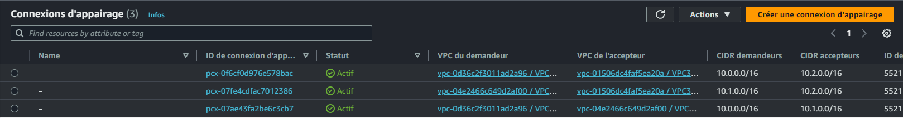

# Création de Sous-réseaux pour chaque VPC

- La création de sous-réseaux est un aspect critique de la configuration d'un VPC, permettant une segmentation et une organisation du réseau. Chaque sous-réseau est une division logique d'un VPC.

aws ec2 create-subnet --vpc-id vpc-0d36c2f3011ad2a96 --cidr-block 10.0.1.0/24 --availability-zone us-east-1a --query Subnet.SubnetId --output text
aws ec2 create-tags --resources [subnet-0e4e87f1b8b4742bd]  --tags Key=Name,Value=greco-subnet-01

aws ec2 create-subnet --vpc-id vpc-04e2466c649d2af00 --cidr-block 10.1.1.0/24 --availability-zone us-east-1a --query Subnet.SubnetId --output text
aws ec2 create-tags --resources [subnet-06276d7b8dc205aaa] --tags Key=Name,Value=greco-subnet-02

aws ec2 create-subnet --vpc-id vpc-01506dc4faf5ea20a --cidr-block 10.2.1.0/24 --availability-zone us-east-1a --query Subnet.SubnetId --output text
aws ec2 create-tags --resources [subnet-0496154e854eb20f8] --tags Key=Name,Value=greco-subnet-03

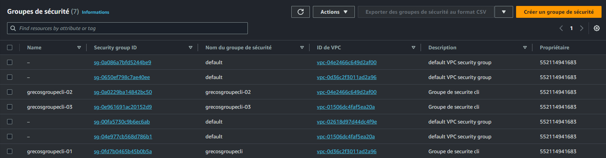

# Configuration d'Internet Gateway pour VPC1
- Accès Internet : Fournit un moyen pour les instances dans votre VPC d'accéder à internet, et pour internet d'accéder à ces instances.
- Routeur Redondant et Hautement Disponible : AWS garantit que l'Internet Gateway est redondante et horizontalement évolutive, offrant une connexion fiable à internet.
- NAT pour Instances avec Adresses IP Privées : Les instances avec des adresses IP privées peuvent accéder à internet ou être accessibles d'internet (si configuré) via l'Internet Gateway, qui agit comme un NAT.

aws ec2 create-internet-gateway --query InternetGateway.InternetGatewayId --output text
aws ec2 create-tags --resources [igw-0ef469e78b05c2c2c] --tags Key=Name,Value=greco-gateway-cli
aws ec2 attach-internet-gateway --vpc-id vpc-0d36c2f3011ad2a96 --internet-gateway-id igw-0ef469e78b05c2c2c

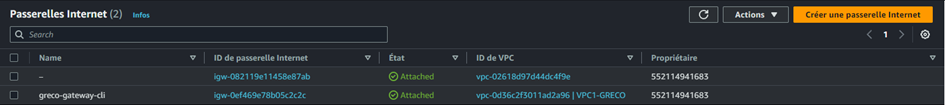

# Configuration des Tables de Routage pour chaque VPC

- Contrôle du Trafic Réseau : Permet de contrôler où le trafic réseau est dirigé en fonction de l'adresse de destination du trafic.
- Séparation des Réseaux Internes et Externes : Vous pouvez avoir une table de routage pour le trafic internet (associée à l'Internet Gateway) et d'autres pour le trafic interne.
- Connexion à Internet : Associer une table de routage à une Internet Gateway permet aux instances dans les sous-réseaux associés d'accéder à internet.
- Routage pour les Connexions d'Appairage VPC ou VPN : Gérer le routage pour les connexions d'appairage entre VPCs ou connexions VPN.

aws ec2 create-route-table --vpc-id vpc-0d36c2f3011ad2a96 --query RouteTable.RouteTableId --output text
aws ec2 create-tags --resources [rtb-078436607e1d199d7] --tags Key=Name,Value=greco-routable-cli-01
...

Pour la machine virtuelle publique :

Pour les machines virtuelles uniquement privées : 

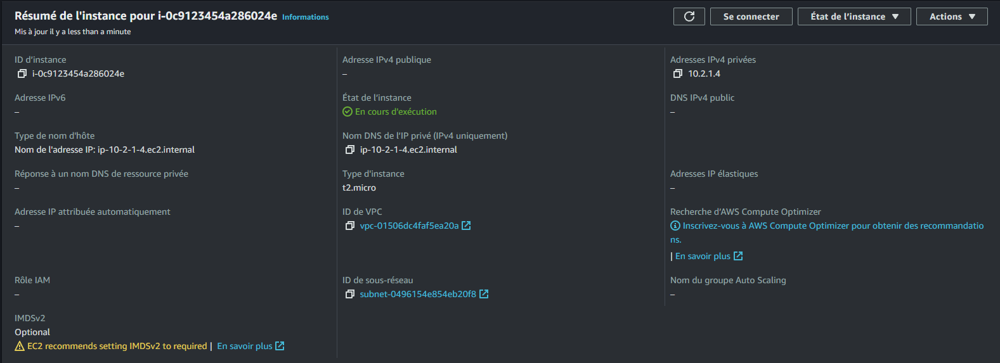

# Association de Sous-réseaux et Tables de Routage
- Définition des Chemins de Trafic : Permet de spécifier des chemins de trafic différents pour différents sous-réseaux. Par exemple, certains sous-réseaux peuvent être configurés pour n'envoyer du trafic qu'au sein du VPC tandis que d'autres sont configurés pour accéder à internet.
- Isolation et Sécurité : En contrôlant le routage, vous pouvez isoler les différents environnements dans votre VPC (comme la production et le développement) ou implémenter des modèles de sécurité plus stricts pour certains sous-réseaux.
- Flexibilité et Personnalisation : Permet une flexibilité dans la gestion du réseau, où différents sous-réseaux peuvent être configurés pour des besoins spécifiques, comme les sous-réseaux publics pour les serveurs web et les sous-réseaux privés pour les bases de données.

aws ec2 associate-route-table --route-table-id rtb-03d2bc95bc4d4ec96 --subnet-id subnet-0e4e87f1b8b4742bd
aws ec2 associate-route-table --route-table-id vpc-0d36c2f3011ad2a96 --subnet-id subnet-0subnet-0e4e87f1b8b4742bd
...

# Création et Acceptation des Connexions d'Appairage VPC
- Réseau Étendu : Permet à des instances dans différents VPC de communiquer entre elles sans utiliser l'internet public, améliorant la sécurité et réduisant la latence.
- Partage de Ressources : Facilite le partage de ressources comme les bases de données ou les serveurs de fichiers entre VPCs, idéal pour les architectures multi-VPC.
- Isolation et Organisation : Permet une meilleure organisation et isolation des projets ou des environnements (comme le développement, la mise en scène et la production) tout en permettant la communication nécessaire entre ces environnements.
- Simplification de la Gestion Réseau : Réduit la complexité en évitant la nécessité de configurer des VPNs ou d'autres connexions réseau plus complexes.

aws ec2 create-vpc-peering-connection --vpc-id vpc-0d36c2f3011ad2a96 --peer-vpc-id vpc-04e2466c649d2af00

aws ec2 accept-vpc-peering-connection --vpc-peering-connection-id pcx-07fe4cdfac7012386

aws ec2 accept-vpc-peering-connection --vpc-peering-connection-id pcx-0f6cf0d976e578bac
...
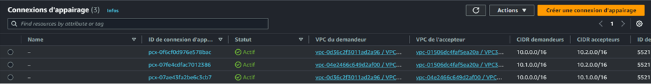

# Création de Groupes de Sécurité et Règles pour chaque VPC
- Filtrage du Trafic : Les groupes de sécurité contrôlent l'accès au et depuis les instances EC2. Vous pouvez spécifier les ports, protocoles, et plages d'adresses IP autorisés à communiquer avec vos instances.
- Sécurité au Niveau de l'Instance : Bien qu'ils soient associés à des interfaces réseau, ils offrent une couche de sécurité au niveau de l'instance EC2, vous permettant de spécifier des règles différentes pour chaque instance ou groupe d'instances.
- Facilité de Gestion : Vous pouvez modifier les règles des groupes de sécurité à tout moment ; les nouvelles règles sont automatiquement appliquées à toutes les instances associées.
- Règles Stateful : Les groupes de sécurité sont stateful, ce qui signifie que si le trafic entrant est autorisé, le trafic sortant correspondant est automatiquement autorisé, simplifiant ainsi la gestion du trafic réseau.

aws ec2 create-security-group --group-name grecosgroupecli --description "Groupe de securite cli" --vpc-id vpc-0d36c2f3011ad2a96

aws ec2 create-security-group --group-name grecosgroupecli-02 --description "Groupe de securite cli" --vpc-id vpc-04e2466c649d2af00
...

# Autoriser l'accès SSH et HTTP pour chaque groupe

- Cette commande est utilisée pour configurer les règles de sécurité dans les groupes de sécurité AWS, qui agissent comme des pare-feu virtuels pour contrôler le trafic vers et depuis vos instances EC2.

aws ec2 authorize-security-group-ingress --group-id sg-0fd7b0465b45b0b5a --protocol tcp --port 22 --cidr 0.0.0.0/0

aws ec2 authorize-security-group-ingress --group-id sg-0fd7b0465b45b0b5a --protocol tcp --port 80 --cidr 0.0.0.0/0

aws ec2 authorize-security-group-ingress --group-id sg-0a0229ba14842bc50 --protocol tcp --port 80 --cidr 0.0.0.0/0
...

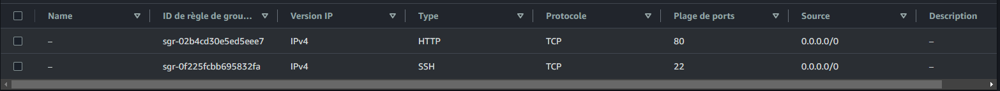

# Lancement d'Instances dans les sous-réseaux respectifs

- Cette commande est utilisée pour lancer de nouvelles instances EC2 dans votre VPC. Elle vous permet de spécifier la configuration de l'instance, y compris le type d'instance, l'image de l'instance, le réseau et les groupes de sécurité.

aws ec2 run-instances --image-id ami-058bd2d568351da34 --count 1 --instance-type t2.micro --key-name mysshprivatekey --security-group-ids sg-0fd7b0465b45b0b5a --subnet-id subnet-0e4e87f1b8b4742bd --associate-public-ip-address

aws ec2 run-instances --image-id ami-058bd2d568351da34 --count 1 --instance-type t2.micro --key-name mysshprivatekey --security-group-ids sg-0a0229ba14842bc50 --subnet-id subnet-06276d7b8dc205aaa --no-associate-public-ip-address
...

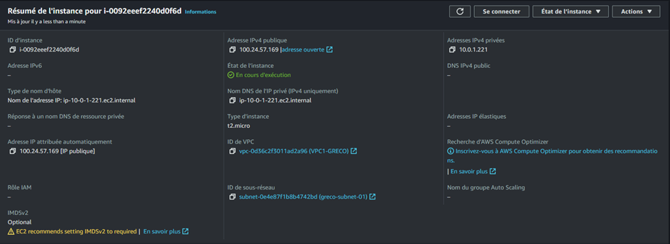

# Commandes de Connexion SSH avec rebon pour Accéder aux Instances Privées

- Ces commandes permettent d'accéder à des instances situées dans des réseaux privés en utilisant un serveur bastion ou une instance "jump" située dans un réseau public. L'option -o ProxyCommand est utilisée pour se connecter via un hôte intermédiaire.

ssh -o ProxyCommand="ssh -W %h:%p -i mysshprivatekey.pem admin@100.24.57.169" -i mysshprivatekey.pem admin@10.1.1.15

ssh -o ProxyCommand="ssh -W %h:%p -i mysshprivatekey.pem admin@100.24.57.169" -i mysshprivatekey.pem admin@10.2.1.4

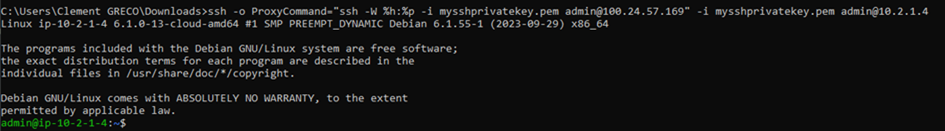

# Commandes pour la mise à jour et l'installation de Nginx sur une VM publique

- Ces commandes sont destinées à préparer le système pour le service web en mettant à jour les paquets disponibles et en installant le serveur web Nginx.

sudo apt update

sudo apt install ngnix

# Création du bucket 

aws s3 mb : Crée un nouveau bucket nommé "bucket-greco" dans Amazon S3.
Configuration d'un Site Web S3 : aws s3 website s3://bucket-greco/ --index-document index.html --error-document error.html

aws s3 website : Configure le bucket "bucket-greco" pour héberger un site web statique, avec "index.html" comme page d'accueil et "error.html" comme page d'erreur.

aws s3 mb s3://bucket-greco

aws s3 website s3://bucket-greco/ --index-document index.html --error-document error.html      

- Configuration du Bucket : 

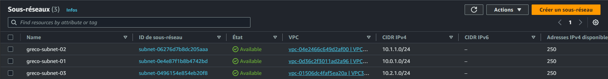

- Preuve :

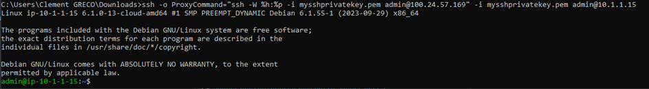

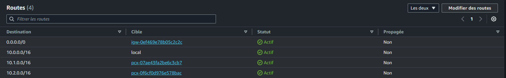

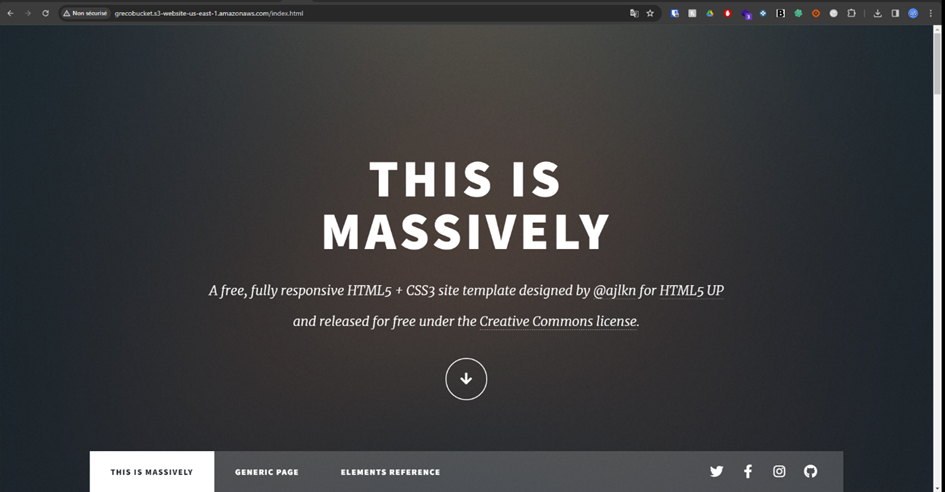

# Conclusion : 

Ce projet illustre non seulement l'efficacité et la polyvalence de l'infrastructure cloud AWS, mais aussi l'importance de comprendre et de maîtriser les outils de ligne de commande pour interagir efficacement avec ces services. Avec ces compétences et outils, vous pouvez construire, configurer et maintenir des architectures cloud solides pour une variété d'applications, depuis le stockage de données et le déploiement de sites web jusqu'à la création de réseaux complexes et sécurisés.

